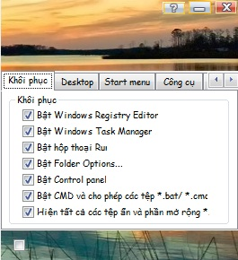
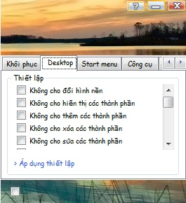
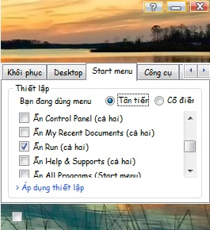
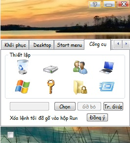
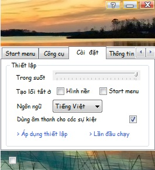
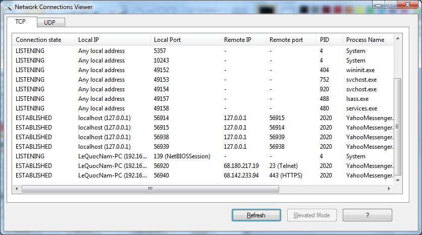
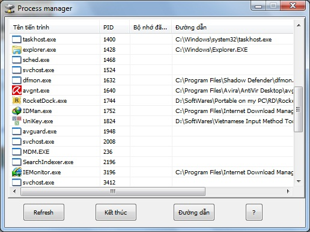
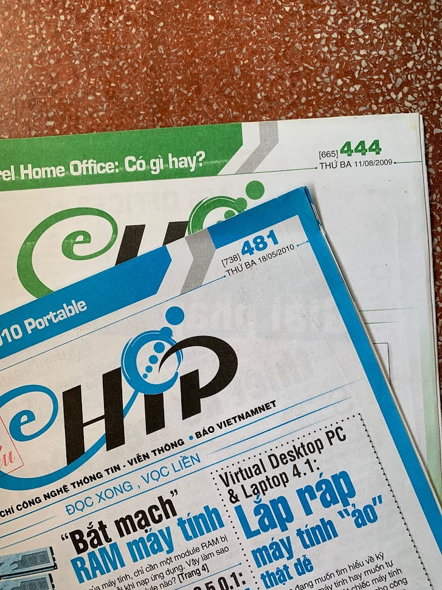
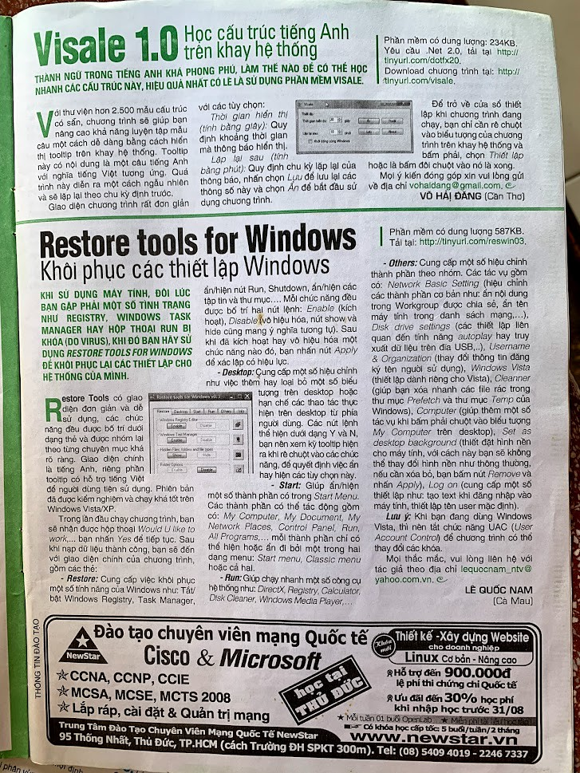
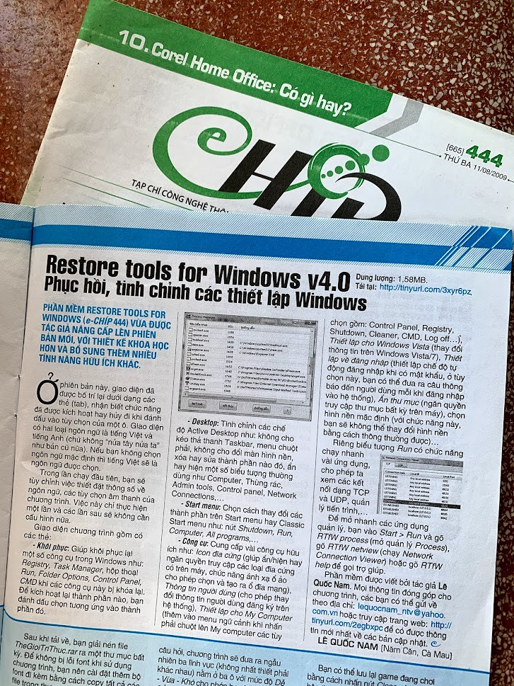

# rtfw-restore-tool-for-windows-v4.0

An Autoit program made by me in 2010 when I was in grade 12. 
The last release version is 4.0.0 on 26 Apr 2010

## Specs

- Language: AutoIt scripting
- Platform: Windows NT/Windows XP/Windows Vista/Windows 7

## History

- v0.1: Summer Year 11 (2009) , first posted: June 26, 2009
- v0.2: http://www.mediafire.com/download.php?koh5doyuqwn
- v0.3: http://www.mediafire.com/download.php?mndkdkvwwom (dung lượng 587 Kb)
- v1.0: http://www.mediafire.com/download.php?tmymoizznz0 (dung lượng 1.1 Mb)
- v2.0: http://www.mediafire.com/download.php?t2mnmmnut5k (dung lượng 1.15 Mb) - md5: 2ac3f78540f754916f95fcfcd31039cc
- v3.0: http://www.mediafire.com/download.php?h2wywynzyjg (dung lượng 1.14 MB) - md5: 94380723c43926ca98d29c95e71dd193
- v4.0: http://www.mediafire.com/download.php?wzgnzyqwnfm (dung lượng 1.58 MB) - md5: 5b867084a1de2b2c3cacaebdcc603a37 - Last version, Apr 26, 2010

## Blog
Blog post (in Vietnamese): https://nready.net/rtfw/

## Screenshots

## Author
- Le Quoc Nam - lequocnam_ntv@yahoo.com.vn | muatinhyeu_812@yahoo.com.vn | leqnam@live.com